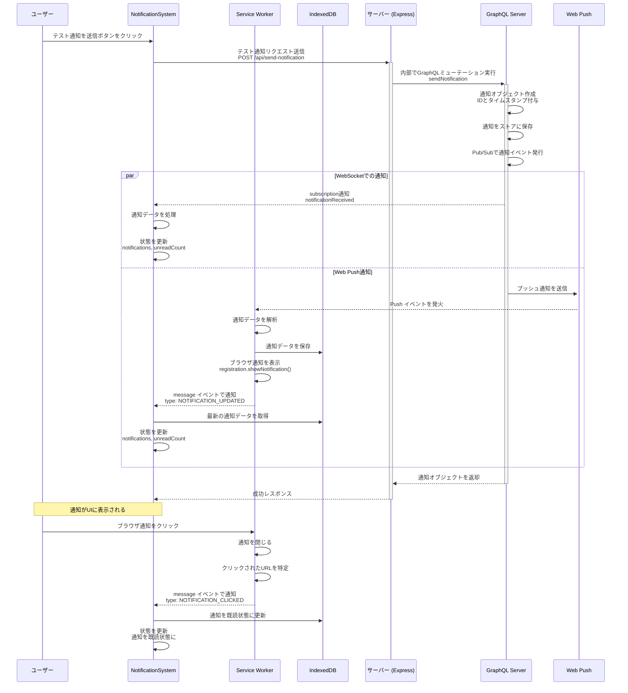
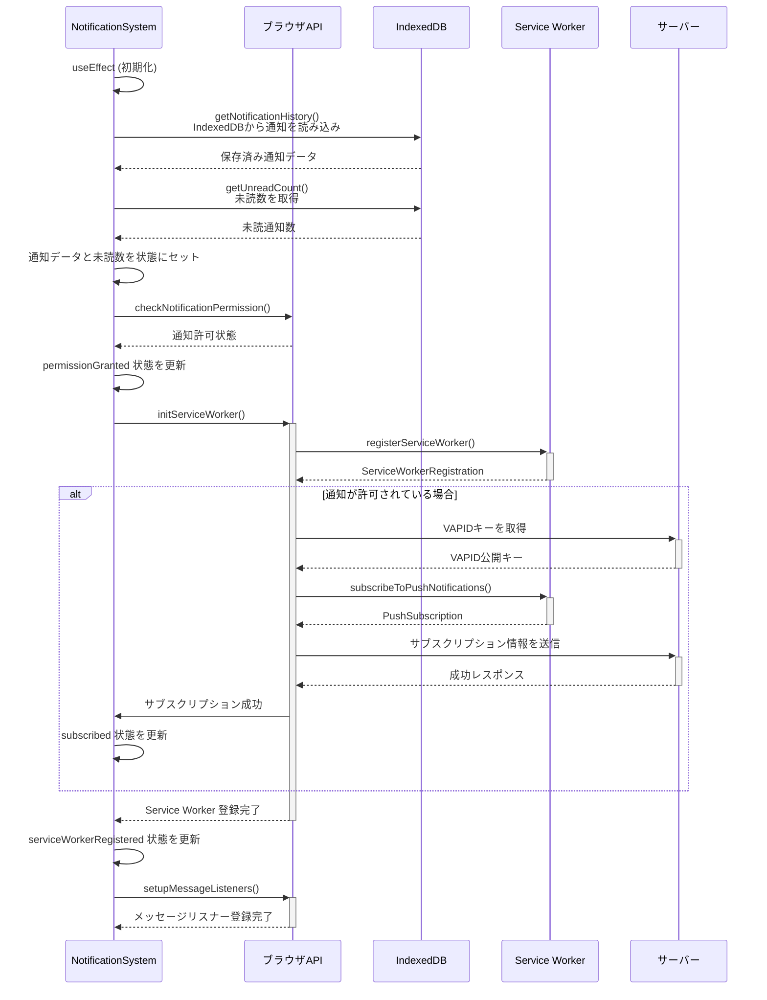

# NotificationSystem コンポーネント仕様

## 概要

`NotificationSystem` コンポーネントは、GraphQL subscription を使用してサーバーと永続的な接続を確立し、サーバープッシュでリアルタイム通知を受信する機能を提供します。

## 機能

- **GraphQL Subscription**: サーバーとの接続に GraphQL subscription を利用し、リアルタイムなデータストリームを確立します。
- **サーバープッシュ通知**: サーバーからプッシュされる通知をリアルタイムで受信し、ユーザーに表示します。
- **IndexedDBによるストレージ**: 通知データをブラウザのIndexedDBに保存し、Service Workerからも直接アクセス可能にします。

## 技術スタック

- GraphQL Subscription
- サーバープッシュ
- Service Worker
- Web Push API
- IndexedDB

## 詳細設計

### テスト通知送信から受信までのフロー図



### 通知システムの初期化フロー



### GraphQL Subscription

- **Subscription クエリ**: `NOTIFICATION_SUBSCRIPTION` 定数で定義された GraphQL subscription クエリ `OnNewNotification` を使用します。
  ```graphql
  subscription OnNewNotification {
    notificationReceived {
      id
      title
      body
      type
      createdAt
      metadata {
        url
        imageUrl
        priority
        category
      }
    }
  }
  ```
- **リアルタイム受信**: サーバーから `notificationReceived` イベントがプッシュされると、新しい通知データがリアルタイムで受信されます。
- **データ構造**: 受信する通知データは以下の構造を持ちます。
  ```typescript
  interface NotificationPayload {
    id: string;
    title: string;
    body: string;
    type: string;
    createdAt: string;
    metadata: {
      url?: string;
      imageUrl?: string;
      priority?: string;
      category?: string;
    };
  }
  ```

### IndexedDBストレージ

- **データベース構造**: IndexedDBデータベースに通知が保存されます。
  ```typescript
  interface NotificationDatabase {
    name: 'NotificationSystem';
    version: 1;
    stores: {
      notifications: {
        keyPath: 'id';
        indexes: {
          timestamp: { unique: false };
          read: { unique: false };
        }
      }
    }
  }
  ```
- **Service Worker連携**: Service Workerは直接IndexedDBにアクセスして通知データを操作します。これにより、アプリケーションがアクティブでない場合でも通知データを管理できます。
- **非同期アクセス**: IndexedDBへのアクセスは全て非同期（Promise）ベースのAPIで実装されています。

### サーバープッシュ通知

- **Service Worker**: `service-worker.js` で Service Worker を登録し、プッシュ通知をリッスンします。
- **メッセージング**: Service Worker から `message` イベントを介して、受信したプッシュ通知データが `NotificationSystem` コンポーネントに渡されます。
- **イベント種別**: Service Worker から送信されるメッセージには以下の種別があります。
  - `NOTIFICATION_UPDATED`: 新しい通知を受信または更新した場合
  - `NOTIFICATION_CLICKED`: 通知がクリックされた場合

### 状態管理

- **`notifications: Notification[]`**: 通知履歴を保持する状態変数。IndexedDB から非同期に初期化され、新しい通知が追加されるたびに更新されます。
- **`unreadCount: number`**: 未読通知数を保持する状態変数。通知が既読になるか、新しい通知が追加されるたびに更新されます。
- **`permissionGranted: boolean`**: 通知許可の状態を保持する状態変数。`checkNotificationPermission` 関数で更新されます。
- **`serviceWorkerRegistered: boolean`**: Service Worker の登録状態を保持する状態変数。`initServiceWorker` 関数で更新されます。
- **`subscribed: boolean`**: プッシュ通知の購読状態を保持する状態変数。`initServiceWorker` 関数および `handleRequestPermission` 関数で更新されます。

### 機能詳細

- **通知許可**: `handleRequestPermission` 関数で `requestNotificationPermission` 関数を呼び出し、ユーザーに通知許可を要求します。許可状態は `permissionGranted` 状態変数に反映されます。
- **Service Worker 登録**: `initServiceWorker` 関数で `registerServiceWorker` 関数を呼び出し、Service Worker を登録します。登録状態は `serviceWorkerRegistered` 状態変数に反映されます。プッシュ通知が許可されている場合、`subscribeToPushNotifications` 関数を呼び出してプッシュ通知を購読します。購読状態は `subscribed` 状態変数に反映されます。
- **テスト通知**: `handleSendTestNotification` 関数で `sendTestNotification` 関数を呼び出し、テスト通知を送信します。
- **通知の更新**: `refreshNotifications` 関数でIndexedDBから最新の通知データを取得し、UIを更新します。
- **既読処理**:
  - `handleMarkAsRead(id)`: 指定された ID の通知を既読にします。`markNotificationAsRead` 関数を呼び出し、`notifications` と `unreadCount` 状態変数を更新します。
  - `handleMarkAllAsRead()`: すべての通知を既読にします。`markAllNotificationsAsRead` 関数を呼び出し、`notifications` と `unreadCount` 状態変数を更新します。
- **削除処理**:
  - `handleDeleteNotification(id)`: 指定された ID の通知を削除します。`deleteNotification` 関数を呼び出し、`notifications` と `unreadCount` 状態変数を更新します。
  - `handleClearAll()`: すべての通知を削除します。`clearNotificationHistory` 関数を呼び出し、`notifications` と `unreadCount` 状態変数を更新します。

### コンポーネント構成

- **通知ベルアイコン**: 未読通知数を表示します。
- **コントロール**:
  - 通知許可/購読ボタン
  - テスト通知送信ボタン
  - すべて既読にするボタン
  - すべて削除ボタン
- **通知リスト**: 通知履歴を表示します。通知アイテムごとに、タイトル、本文、日時、既読/未読状態、アクションボタン (既読にする、削除、開く) が表示されます。
- **デバッグ情報**: 通知許可状態、Service Worker 登録状態、プッシュ通知購読状態、GraphQL エラーなどのデバッグ情報を表示します。

## 今後の展望

- **通知カテゴリのサポート**: 異なるカテゴリの通知に対して、フィルタリングや表示のカスタマイズを追加する。
- **通知設定**: ユーザーが通知の種類やタイミングをカスタマイズできる設定画面を追加する。
- **通知のグループ化**: 類似した通知をグループ化し、UIをスッキリさせる機能を追加する。
- **オフライン対応**: 既にIndexedDBを使用しているため、オフライン時の通知管理が容易になりました。オフラインで生成された通知の同期システムを追加することができます。
- **バックグラウンド処理の強化**: Service WorkerとIndexedDBの組み合わせにより、バックグラウンドでの通知処理をさらに強化できます。